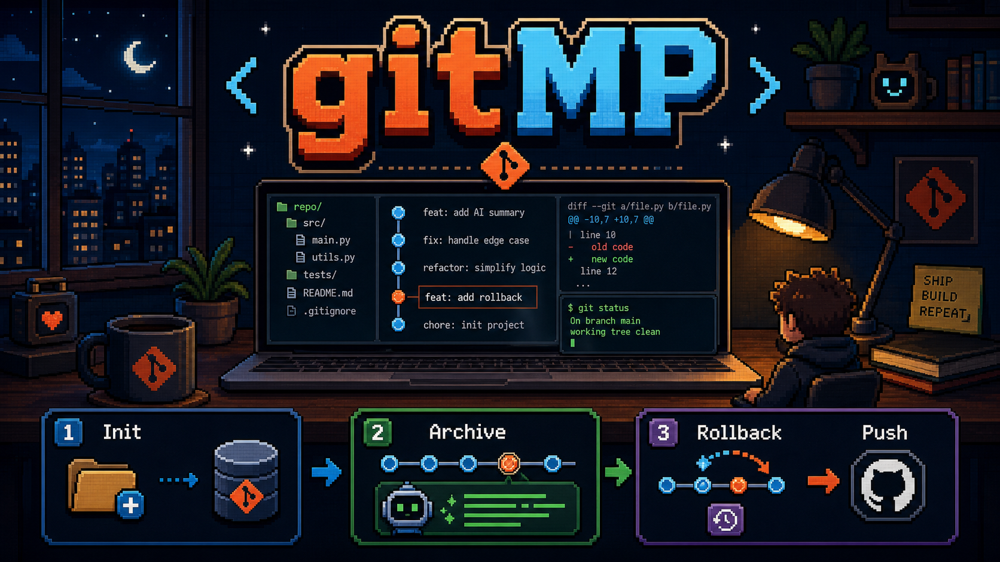

<div align="center">



# 🚀 gitMP - Git版本管理助手

**一个智能化的项目版本管理技能，让Git操作更简单、更安全**

</div>

---

## 📋 简介

gitMP 是一个AI辅助的Git版本管理工具，帮助你轻松完成项目的版本控制、归档和迭代。通过三步工作流，自动生成提交总结，支持版本回退和一键推送到[...]

### 🎯 核心特性

- ✨ **智能存档** - AI自动读取项目文件，生成工作总结
- 🔄 **安全回退** - 回档前强制展示diff，防止误操作丢失代码  
- 🚀 **一键推送** - 输入GitHub URL自动配置并推送
- 🛡️ **版本保护** - 完整的提交历史和操作确认机制

---

## 🎮 触发方式

| 触发词 | 说明 |
|-------|------|
| `/git-mp` | 直接触发gitMP |
| `存档` | 版本存档 |
| `回退版本` | 版本回退 |
| `推送到GitHub` | 推送到远程仓库 |
| `初始化git` | 初始化新仓库 |

---

## 🔄 工作流程

### 三步工作流

| 步骤 | 功能 | 说明 |
|-----|------|------|
| **1️⃣ 初始化** | `git init` + `.gitignore` + 首次commit | 自动检测是否已有仓库，无则创建 |
| **2️⃣ 日常存档** | `git add -A` + `commit` | 用户写备注，AI自动生成工作总结并合并到commit message |
| **3️⃣ 选择操作** | 回退 / 推送 / 结束 | 三选一 |

### Step 3 - 两条路径

#### 🔙 版本回退
```
展示commit列表 → 用户选择目标 → 显示将丢失的改动 → 确认后执行 git reset --hard
```

#### 🚀 版本迭代  
```
输入GitHub URL → 自动配置remote → git push
```

---

## 🔐 安全机制

**核心设计理念**：回档前强制展示 `git diff --stat`，用户确认后才执行，防止误操作丢失代码。

> ⚠️ **所有破坏性操作均需二次确认，确保数据安全**

---

## ⚙️ 配置指南

### GitHub推送配置

推送到GitHub需要配置 `gh CLI` 工具，步骤如下：

#### 1. 生成Personal Access Token
- 访问 [GitHub Settings → Developer Settings → Personal access tokens](https://github.com/settings/tokens)
- 点击 "Generate new token"
- 启用 **repo** 权限（编辑仓库权限）
- 生成并复制token

#### 2. 配置gh CLI
```bash
gh auth login
```

按照提示：
- 选择 `GitHub.com`
- 选择 `HTTPS`
- 输入你的GitHub账号
- 选择 "Paste an authentication token"
- 粘贴刚才复制的token

✅ 配置完成！即可正常使用推送功能

---

## 📝 使用示例

```
用户: 今天完成了登录界面的美化和性能优化

gitMP流程:
1️⃣ 检测项目状态
2️⃣ 生成commit message: "feat: 完成登录界面美化和性能优化 - [AI总结]"
3️⃣ 提供操作选项
   ├─ 回退到之前的版本
   ├─ 推送到GitHub
   └─ 结束此次操作
```

---

## 💡 最佳实践

- 每天至少提交一次版本存档
- 推送前检查生成的diff内容
- 为复杂改动提供详细的备注说明
- 定期检查commit历史，保持清晰的版本记录

---

<div align="center">

**Happy versioning! 🎉**

Made with ❤️ by gitMP

</div>
